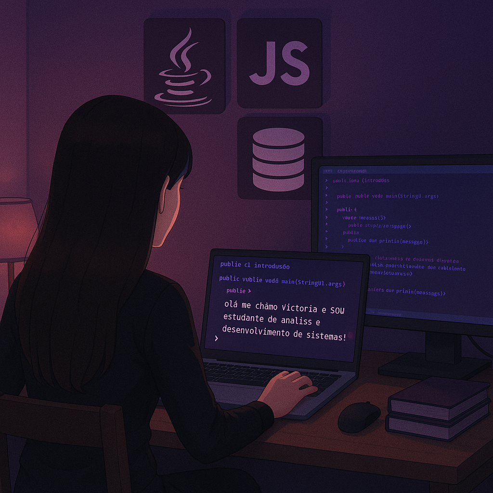

  <tr>
    <h1>👩🏻‍💻 Victória - Estudante de Análise e Desenvolvimento de Sistemas</h1>
  </tr>
  <tr>
      <td></td>
  </tr>

<h2>Desenvolvedora Full Stack em formação</h2>

- Aprendendo todos os dias e praticando muito!
- Atualmente estudando: Java, JavaScript, Spring e React
- Buscando uma oportunidade de estágio na área de desenvolvimento

<h2>Tecnologias💜</h2>

<table>
  <tr>
    <td></td>
    <td></td>
    <td></td>
  </tr>
  <tr>
    <td></td>
    <td></td>
    <td></td>
  </tr>
  <tr>
    <td></td>
    <td></td>
    <td></td>
  </tr>
  <tr>
    <td></td>
    <td></td>
    <td></td>
  </tr>
</table>

<h2>Estatísticas GitHub</h2>
  
  

<picture align="center">
  <source media="(prefers-color-scheme: dark)" srcset="https://raw.githubusercontent.com/ViictoriaDev/ViictoriaDev/output/github-contribution-grid-snake-dark.svg">
  <source media="(prefers-color-scheme: light)" srcset="https://raw.githubusercontent.com/ViictoriaDev/ViictoriaDev/output/github-contribution-grid-snake-dark.svg">
  
</picture>

## Vamos nos conectar?

 

