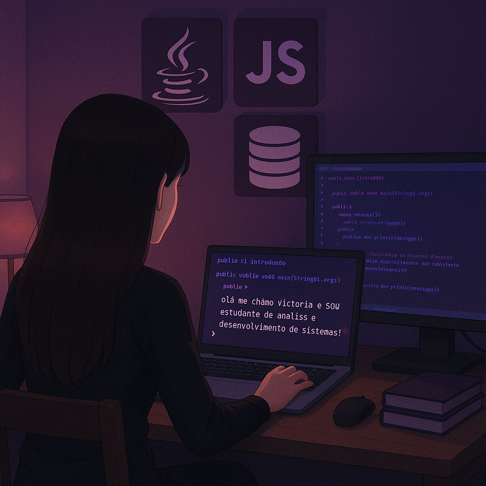

 
  

  <h1>👩🏻‍💻 Victória - Backend Developer</h1>
      

- Evoluindo continuamente por meio de projetos e estudos
- 💻 Desenvolvendo aplicações com C#/.NET
- Em busca de uma oportunidade como Desenvolvedora

<h2>Tecnologias 💜</h2>

<table>
  <tr>
    <td></td>
    <td></td>
    <td></td>
  </tr>
  <tr>
    <td></td>
    <td></td>
    <td></td>
  </tr>
  <tr>
    <td></td>
    <td></td>
    <td></td>
  </tr>
  <tr>
    <td></td>
    <td></td>
    <td></td>
  </tr>
</table>

<h2>Estatísticas GitHub</h2>

<picture align="center">
  <source media="(prefers-color-scheme: dark)" srcset="https://raw.githubusercontent.com/ViictoriaDev/ViictoriaDev/output/github-contribution-grid-snake-dark.svg">
  <source media="(prefers-color-scheme: light)" srcset="https://raw.githubusercontent.com/ViictoriaDev/ViictoriaDev/output/github-contribution-grid-snake-dark.svg">
  
</picture>

<h2>Entre em contato comigo: </h2>
<table>
  <tr>
    <td>
       
      </td>
    <td>
        
    </td>
  </tr>

